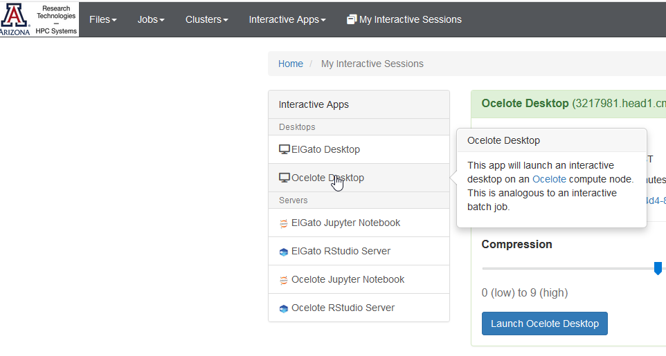

# Practical 01: Logging on to HPC


## Objectives 01

- Explore several ways of logging on to the HPC
- Appreciate the distinction between compute and login nodes
- Get a quick introduction to how commands are made on the HPC and how resources are requested
- Explore briefly some of the foundational  features of Open On Demand

More documentation here https://public.confluence.arizona.edu/display/UAHPC 

and here https://public.confluence.arizona.edu/display/UAHPC/Open+On+Demand 


### Exercise 01.A: Log on to HPC Desktop using OOD

- Navigate to  **Open On Demand** (**OOD**)  at https://ood.hpc.arizona.edu/ 

- From "Interactive Apps" select the Desktop on the HPC Cluster you want to access 

  

- Request a 2 hour session on HPC cluster

- Open a terminal by right clicking on the desktop and selecting "Open in Terminal"

- notice that you are already in a **compute** node

  ```
  [chidiugonna@i14n7 Desktop]$ 
  ```

  

- Run `matlab`

  ```
  [chidiugonna@i14n7 Desktop]$ module load matlab
  [chidiugonna@i14n7 Desktop]$ matlab
  ```

- Matlab GUI should open successfully

  

### Exercise 01.B: Logon to HPC using Shell Access

- Navigate to  **Open On Demand** (**OOD**)  at https://ood.hpc.arizona.edu/ 

- From "Clusters" select the HPC cluster you want shell access to

  
  
- Notice you are in a **login** node - you will need to hop onto a compute node to execute demanding tasks

  ```
  Last login: Mon Jun 15 14:33:50 2020 from ood.hpc.arizona.edu
  [chidiugonna@login2 ~]$
  ```

  

- Start an interactive compute node in Ocelote Shell access using qsub 

  ```
  [chidiugonna@login2 ~]$ qsub -I -N interactive -m bea -M yourname@emailaddress -W group_list=yourPIid -q standard -l select=1:ncpus=1:mem=6gb -l cput=4:0:0 -l walltime=4:0:0
  ```

  ```
  qsub: waiting for job 3270792.head1.cm.cluster to start
  ```

  qsub will be covered in a little more detail later. 

- Notice you are now in compute node. 

  ```
  [chidiugonna@i0n6 ~]$  
  ```

- View active jobs by opening another tab in ood.hpc.arizona.edu and click on "jobs" > "Active Jobs" and notice that a job called "interactive" is running

- Return to ocelote shell in prevous tab and run matlab in command line mode and exit

  ```
  [chidiugonna@i0n6 ~] module load matlab
  [chidiugonna@i0n6 ~]$ matlab
  MATLAB is selecting SOFTWARE OPENGL rendering.
  
                                                                                                                     < M A T L A B (R) >                                                                Copyright 1984-2020 The MathWorks, Inc.
                   R2020a Update 1 (9.8.0.1359463) 64-bit (glnxa64)
                               April 9, 2020
                                                                                                   
                                                                                         To get started, type doc.
  For product information, visit www.mathworks.com.
   
  Using 1 thread(s) on compute node.
  >> cos(pi/3)
  
  ans =
  
      0.5000
  
  >> exit
  [chidiugonna@i0n6 ~]$
  
  ```

  

- we can drop back to login node by typing in `exit`

  ```
  [chidiugonna@i0n7 ~]$ exit
  logout
  
  qsub: job 3270799.head1.cm.cluster completed
  ```
  
- A few other commands to explore

  - `va` : displays compute hours
  - `qstat -wa -u $USERID` : displays status of jobs
  - `uquota` : displays amount of disk space available


### Exercise 01.C: Browse File System using OOD

- Navigate to  **Open On Demand** (**OOD**)  at https://ood.hpc.arizona.edu/ 

- From "Files" browse the file hierarchy that you have access to
- Experiment with uploading and downloading files and folders (We will see how to transfer large files/folders in a later session)
- Attempt to create a directory and within it a text file
- Try and edit, save and view the text file in the browser.


### Exercise 01.D: Logon to HPC using SSH

- Open a command terminal window on your local window 

  - Terminal App (Mac)
  - Putty or git bash (Windows)
  - Linux terminal

- Logon to HPC using ssh. You will need to use your netid and password.

  ```
  ssh netid@hpc.arizona.edu
  ```

  Attend to two-factor login request:

  ```
  Password:
  Duo two-factor login for chidiugonna
  
  Enter a passcode or select one of the following options:
  
   1. Duo Push to XXX-XXX-3532
   2. Phone call to XXX-XXX-3532
   3. SMS passcodes to XXX-XXX-3532
  
  Passcode or option (1-3):
  
  ```

  ```
  Success. Logging you in...
  Last login: Tue May 12 11:20:55 2020 from ip72-217-44-61.ph.ph.cox.net
  This is a bastion host used to access the rest of the RT/HPC environment.
  
  Shortcut commands to access each resource
  -----------------------------------------
  Ocelote:
  $ ocelote
  
  El Gato:
  $ elgato
  
  ```

  choose your cluster option - we will choose ocelote

  ```
  [chidiugonna@gatekeeper ~]$ ocelote
  Last login: Tue Jun 16 14:28:32 2020 from ood.hpc.arizona.edu
  [chidiugonna@login2 ~]$
  ```

- You are now in a login node and will be able to browse your files and folders

- You can now start interactive compute jobs or submit scripts to the cluster using the qsub command